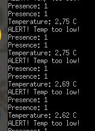
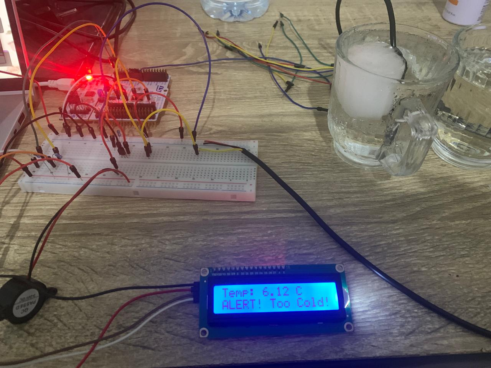
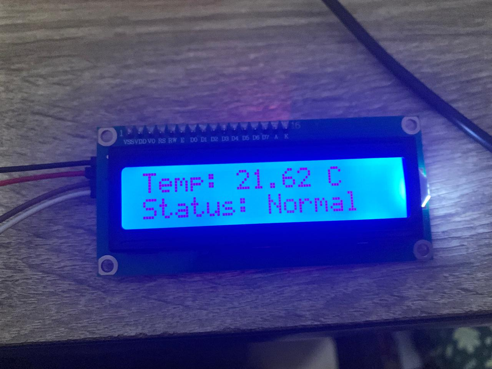

# Temperature Sensor
DS18B20 temperature sensor with I2C LCD display and UART debugging on the STM32 Nucleo-F401RE.

  
  
  

# ℹ️ Overview

A bare-metal embedded project that reads temperature over the 1-Wire protocol, displays it on a 16×2 LCD via I2C, and streams live readings over UART/PuTTY.

The firmware is structured around two independently selectable modes, switchable via a single `#define` in `main.c`: a test mode for hardware bring-up and a main mode for normal operation.

### **Hardware used:**

- stm32 Nucleo board F401RE
- (I2C) display screen 16x2
- DS18B20 sensor

- breadboard
- 4.7k pull-up resistor
- jumper and dupont wires
- piezo buzzer (optional)
- transister npn s8050 & ~1k resistor for base

### Main Features and Functionalities:

- DS18B20 OneWire protocol/driver implemented using TIM1 for microseconds delays
- I2C LCD driver (4-bit mode initialization/cursor positioning/backlight control)
- Test suite validating hardware and peripherals
- UART output debugging (`printf` to PuTTY or any serial terminal at 115200)
- Modular driver design, HAL abstraction layer & Non-blocking main loop
- Configurable thresholds and detecting high/low temperature

### Limitations

- single sensor (skipping ROM)
- hardcoded threshold (reflashing if changed)
- No CRC validation

  The *code only reads 2 bytes (LSB and MSB), meanwhile* *DS18B20 sends 9 bytes (last one is a CRC checksum)*

  *On a long wire or noisy environment, a bit could flip during transmission and produce a wrong temperature reading with no indication anything went wrong.*

# Note on Building

HAL/CMSIS drivers not included — generate via STM32CubeMX using the provided `.ioc` file.
